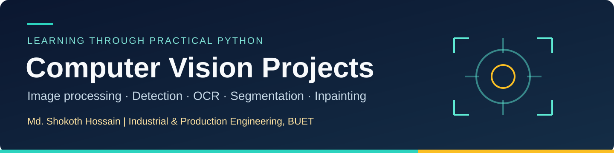
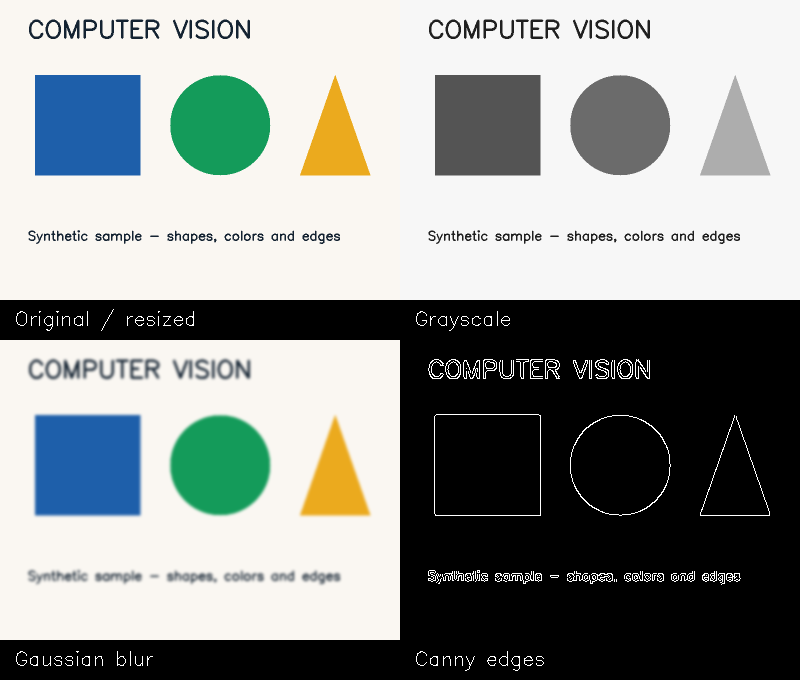

<p align="center"></p>

<p align="center">


</p>

<p align="center"><a href="#project-guide">Project guide</a> · <a href="#quick-start">Quick start</a> · <a href="#image-processing-preview">Preview</a> · <a href="#sources--attribution">Sources</a></p>

## Overview

A hands-on computer vision learning collection covering image and video processing, color and contour detection, face/hand/pose detection, YOLO inference, OCR, semantic segmentation, image inpainting, and frame-difference motion detection.

I am **Md. Shokoth Hossain (Antor)**, an Industrial and Production Engineering graduate from **BUET**. These exercises help me build practical Python skills while exploring how vision methods may eventually support manufacturing inspection and monitoring.

**Status:** course-based practice with documented improvements. This repository is not a benchmarked manufacturing inspection system.

## Project guide

| Category | Demonstrations | Main tools |
| :--- | :--- | :--- |
| Input fundamentals | [Read image](read_image.py), [read video](read_video.py), [read webcam](read_webcam.py) | OpenCV |
| Image processing | [Resize, grayscale, blur, edges](image_processing.py), [drawing and annotations](annotation.py) | OpenCV, NumPy |
| Shapes and colors | [Shape contours](shapes.py), [HSV color filtering](color_detection.py), [color contours](color_contour_detection.py) | OpenCV, CVZone |
| Human landmarks | [Face](face_detection.py), [hands](hand_detection.py), [body pose](body_detection.py) | CVZone, MediaPipe |
| Object detection | [YOLO webcam/video inference](object_detection.py) with the supplied checkpoint | Ultralytics |
| Text recognition | [OCR with text regions](text_detection.py) | Florence-2, Transformers |
| Scene understanding | [Semantic segmentation](semantic_segmentation.py) | Mask2Former, Transformers |
| Image editing | [Prompt-guided inpainting](image_inpainting.py) | Stable Diffusion, Diffusers |
| Motion | [Consecutive-frame motion detection](motion_detection.py) | OpenCV |

The original filename [burgler_presence.py](burgler_presence.py) remains as a compatibility entry point. The program detects **motion**, not a person's identity or intent.

## Image-processing preview



*Actual output from `image_processing.py` using the included synthetic sample. This illustrates processing operations; it is not a model-accuracy result.*

## Quick start

Use **Python 3.10 or 3.11** in a desktop environment for GUI and webcam demos. The dependency files suggest a compatible starting environment; the complete model stack has not been tested end to end.

```bash
git clone https://github.com/MdShokoth/Computer_Vision_Projects.git
cd Computer_Vision_Projects
python -m venv .venv
```

Activate the environment:

```bash
# Windows PowerShell
.venv\Scripts\Activate.ps1

# macOS / Linux
source .venv/bin/activate
```

```bash
python -m pip install -r requirements.txt
python image_processing.py
python read_image.py
python shapes.py
```

Run basic demonstrations without opening windows:

```bash
python image_processing.py --no-display
python read_image.py --no-display
python motion_detection.py --source sample_video.avi --no-display --min-area 50
```

The included image and video are **synthetic examples**. Image outputs go to `outputs/`. For a personal image, supply its path, for example `python image_processing.py path/to/image.jpg`.

### Camera and video demonstrations

```bash
python read_webcam.py --source 0
python face_detection.py --source 0
python hand_detection.py --source 0
python body_detection.py --source 0
python color_detection.py --source 0
python color_contour_detection.py --source 0
python motion_detection.py --source 0
```

Press **q** to quit camera demos; motion detection also accepts **Esc**. HSV thresholds are sample values and will need adjustment for the object and lighting. Motion snapshots are saved only when `--save` is supplied.

### Optional model demonstrations

```bash
python -m pip install -r requirements-models.txt
python object_detection.py --model best.pt --source 0
python text_detection.py sample.png
python semantic_segmentation.py path/to/scene.jpg
python image_inpainting.py path/to/scene.jpg path/to/mask.png --prompt "A landscape with trees and a path"
```

OCR, segmentation, and inpainting download pretrained models. Inpainting supports CPU but can be slow; CUDA is used when available. White mask pixels indicate the region to replace. Florence-2 uses its model repository's custom Python implementation through `trust_remote_code=True`.

## Checkpoint and dataset information

- `best.pt` is the checkpoint supplied with this learning collection. Training history and evaluation metrics have not been independently verified.
- `data.yaml` references a Roboflow **Thumbs-down / Thumbs-up** dataset, version 3, with a **CC BY 4.0** license stated in the supplied metadata.
- The training/validation/test images referenced by the YAML are **not included**. The file preserves dataset metadata rather than providing a complete training pipeline.
- The YOLO demonstration reads class names from the checkpoint itself. The YAML alone does not verify the checkpoint's class mapping.

[Dataset source](https://universe.roboflow.com/mendeteksi-thumbs-up-thumbs-down/thumbs-up-thumbs-down-zobmd/dataset/3)

## What changed for publication

The supplied exercises were adapted with configurable input paths, camera cleanup, safer contour handling, and a corrected motion loop. See [CHANGES.md](CHANGES.md) for details and validation limits.

**Checked:** syntax compilation of every script, headless image reading/processing, synthetic moving-video execution, and frame-difference checks. **Not executed here:** webcam, MediaPipe, YOLO, OCR, segmentation, or inpainting inference.

## Sources & attribution

These are learning implementations based on the course shared with this project, with repository preparation and corrections documented above.

- [Computer vision course](https://youtu.be/E_zUoHGcxRE)
- [CVZone](https://github.com/cvzone/cvzone)
- [OpenCV](https://opencv.org/)
- [Ultralytics](https://github.com/ultralytics/ultralytics)
- [Florence-2 base](https://huggingface.co/microsoft/Florence-2-base)
- [Mask2Former semantic segmentation](https://huggingface.co/facebook/mask2former-swin-large-ade-semantic)
- [Stable Diffusion inpainting](https://huggingface.co/runwayml/stable-diffusion-inpainting)

## Next steps

- Evaluate the YOLO checkpoint on a documented held-out dataset.
- Add real output examples with clear data attribution.
- Explore a small manufacturing-inspection project with a baseline and failure analysis.

---

<p align="center"><b>Md. Shokoth Hossain</b><br /><a href="https://github.com/MdShokoth">GitHub profile</a> · <a href="https://sites.google.com/view/connecttoantor">Personal website</a> · <a href="https://www.linkedin.com/in/md-shokoth-hossain-474b04197">LinkedIn</a> · <a href="https://www.behance.net/mdshokothhoosain">Behance</a></p>
